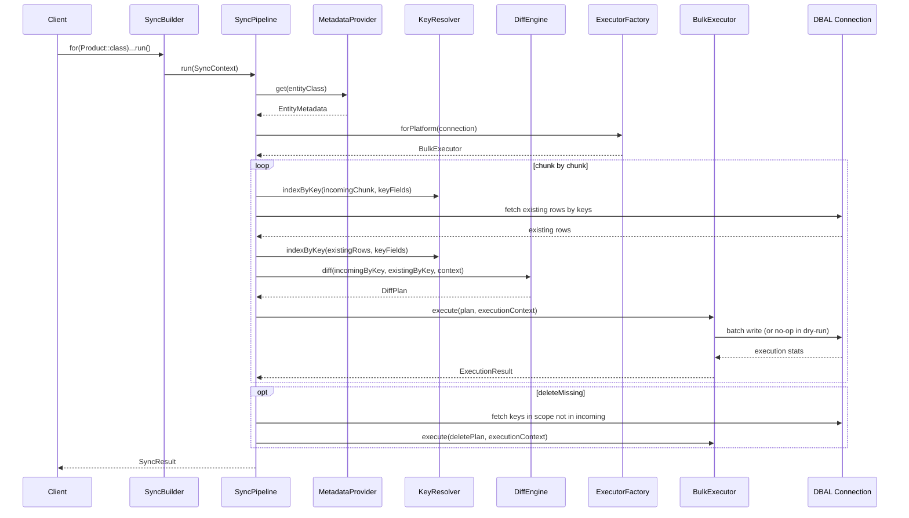

# SyncForge Architecture (MVP v1.0)

## 1. Goal and Scope

`SyncForge` is a Symfony-compatible library for reconciling external data (`iterable<array<string, mixed>>`) with Doctrine-mapped entity tables using DBAL-level batch operations.

MVP goals:

- Fluent API for sync pipeline configuration.
- Reconciliation flow: find existing, detect changes, upsert, optionally delete missing.
- PostgreSQL and MySQL support via platform executors.
- Composite key support.
- Dry-run support with full operation report.
- No UnitOfWork for mass operations.
- No runtime reflection during sync execution (metadata pre-resolved and cached).

Out of MVP:

- Domain validation/events orchestration.
- Generic object mapping beyond array input.
- Advanced JSON deep-diff semantics.
- Async workers/UI/audit persistence.

## 2. Public API

```php
<?php

$result = $syncForge->for(Product::class)
    ->key(['external_id'])
    ->source($rows)
    ->chunkSize(1000)
    ->deleteMissing(true)
    ->dryRun(false)
    ->run();
```

### Fluent contract

- `for(string $entityClass): SyncBuilder`
- `key(array $fields): self`
- `source(iterable $rows): self`
- `deleteMissing(bool $enabled = true): self`
- `chunkSize(int $size): self`
- `dryRun(bool $enabled = true): self`
- `run(): SyncResult`

## 3. Layered Architecture

```text
External Data
    -> Normalization (optional in MVP: pass-through arrays)
    -> KeyResolver
    -> DiffEngine
    -> BulkExecutor
    -> SyncResult
```

### Layer responsibilities

1. `Metadata Layer`
- Reads Doctrine mapping once and exposes table/column/key metadata.
- Caches immutable metadata objects.

2. `Key Layer`
- Builds deterministic key signatures from configured key columns.
- Handles composite keys and null-safety rules.

3. `Diff Layer`
- Compares incoming rows vs existing DB rows.
- Produces operation sets: `insert`, `update`, `delete`.
- Computes changed columns for partial updates.

4. `Execution Layer`
- Chooses platform strategy (PostgreSQL/MySQL/fallback).
- Performs batched DBAL operations.
- Respects dry-run (plan only, no writes).

5. `Orchestration Layer`
- Runs pipeline in chunks.
- Coordinates loading existing records, diffing, executing, and aggregation.
- Produces final `SyncResult`.

## 4. Core Types

## 4.1 Entry Point and Builder

### `SyncForge`

Responsibilities:
- Factory for `SyncBuilder`.
- Holds shared dependencies (metadata provider, executor factory, diff strategy defaults).

Key method:
- `public function for(string $entityClass): SyncBuilder`

### `SyncBuilder`

Responsibilities:
- Fluent configuration object.
- Input validation for required options.
- Constructs immutable `SyncContext` and delegates to pipeline.

State:
- `entityClass`
- `keyFields`
- `source`
- `chunkSize` (default: `1000`)
- `deleteMissing` (default: `false`)
- `dryRun` (default: `false`)

## 4.2 Orchestration

### `SyncPipeline`

Pattern: Template Method (`run()` fixed flow, pluggable strategies inside).

Responsibilities:
- Execute reconciliation steps in deterministic order.
- Stream source in chunks to avoid high memory usage.
- Aggregate per-chunk results.

Pseudo-flow:

1. Resolve metadata.
2. Validate configured key fields against metadata.
3. Iterate source chunks.
4. Resolve keys for chunk.
5. Load existing rows by key.
6. Build diff plan (`insert/update[/delete]`).
7. Execute plan with selected bulk executor.
8. Aggregate stats and diagnostics.
9. If `deleteMissing=true`: compute delete candidates and execute.
10. Return `SyncResult`.

## 4.3 Metadata

### `EntityMetadataProviderInterface`

```php
interface EntityMetadataProviderInterface
{
    public function get(string $entityClass): EntityMetadata;
}
```

### `DoctrineEntityMetadataProvider`

Responsibilities:
- Convert Doctrine class metadata to library-specific `EntityMetadata`.
- Cache by entity class name.
- Expose only precomputed scalar mapping needed by diff/executor.

### `EntityMetadata` (value object)

Contains:
- Entity class.
- Table name.
- Column map (`property => column` and reverse if needed).
- Column types (DBAL type names).
- Nullable flags.
- Identifier columns.
- Updatable columns (excluding identifiers/version columns if configured).

## 4.4 Key Strategy

### `KeyResolverInterface`

```php
interface KeyResolverInterface
{
    /**
     * @param list<array<string,mixed>> $rows
     * @param list<string> $keyFields
     * @return array<string, array<string,mixed>> map<keySignature, row>
     */
    public function indexByKey(array $rows, array $keyFields): array;

    /**
     * @param array<string,mixed> $row
     */
    public function makeKey(array $row, array $keyFields): string;
}
```

### `CompositeKeyResolver`

Responsibilities:
- Stable key signature generation for single/composite keys.
- Collision-safe serialization (e.g., length-prefixed fragments).
- Explicit handling of missing key fields.

## 4.5 Diff Strategy

### `DiffEngineInterface`

```php
interface DiffEngineInterface
{
    /**
     * @param array<string,array<string,mixed>> $incomingByKey
     * @param array<string,array<string,mixed>> $existingByKey
     */
    public function diff(
        array $incomingByKey,
        array $existingByKey,
        DiffContext $context
    ): DiffPlan;
}
```

### `ScalarDiffEngine`

Responsibilities:
- Classify each incoming key into `insert` or `update` (if changed).
- Generate minimal changed-column payload for updates.
- Optionally identify `delete` candidates when full scope known.

Comparison rules (MVP):
- Strict by normalized scalar value.
- Datetime compared in canonical string format.
- Null and empty-string not equal by default.
- JSON/blob fields treated as opaque scalar (string compare only).

### `DiffPlan` (value object)

Contains:
- `inserts`: list of row payloads.
- `updates`: list of `{key, changedColumns, fullRow?}` payloads.
- `deletes`: list of keys (or key payloads).
- Counters and optional diagnostics.

## 4.6 Bulk Execution

### `BulkExecutorInterface`

```php
interface BulkExecutorInterface
{
    public function supports(DatabasePlatformContext $platform): bool;

    public function execute(DiffPlan $plan, ExecutionContext $context): ExecutionResult;
}
```

### Implementations

- `PostgresBulkExecutor` (target: `ON CONFLICT` strategy).
- `MySqlBulkExecutor` (target: `ON DUPLICATE KEY` strategy).
- `FallbackBatchExecutor` (manual insert/update/delete batching via DBAL statements).

### `BulkExecutorFactory`

Responsibilities:
- Detect current platform from Doctrine DBAL connection metadata.
- Resolve executor by strategy.
- Fail fast with clear exception for unsupported environments.

## 4.7 UoW Isolation Layer

### `UowIsolationGuard`

Responsibilities:
- Ensure execution uses DBAL connection directly.
- Guard rails against accidental `EntityManager::persist/flush` in pipeline.
- Optionally suppress ORM lifecycle integration for sync path.

MVP simplification:
- Sync pipeline never materializes entities and never calls ORM write APIs.

## 4.8 Report Object

### `SyncResult`

Fields:
- `entityClass`
- `startedAt`, `finishedAt`, `durationMs`
- `processedRows`
- `inserted`, `updated`, `deleted`
- `unchanged`
- `chunkCount`
- `dryRun`
- `errors` (non-fatal/partial failures if policy allows)

Methods:
- `isSuccess(): bool`
- `toArray(): array`

## 5. Sequence Diagram



## 6. Extension Points

- `KeyResolverInterface`: custom key canonicalization rules.
- `DiffEngineInterface`: custom diff semantics (tolerance, JSON deep compare, case-insensitive).
- `BulkExecutorInterface`: additional platforms or vendor-specific optimizations.
- `NormalizationStageInterface` (future): input normalization from CSV/API schemas.

## 7. Error Model

Primary exceptions:
- `InvalidConfigurationException` (missing key/source, invalid chunk size).
- `MetadataException` (unknown entity/field mapping mismatch).
- `UnsupportedPlatformException`.
- `SyncExecutionException` (DB errors with context).

Policy:
- Fail fast on configuration/metadata issues before any write.
- Per-chunk execution errors include chunk index and sample keys.

## 8. Trade-offs

1. DBAL bulk path vs ORM safety
- Pros: performance and memory stability for large datasets.
- Cons: lifecycle callbacks/listeners are bypassed.

2. Diff precision vs complexity
- Pros: scalar-only diff is predictable and fast for MVP.
- Cons: complex JSON and domain-specific equivalence not handled.

3. Partial updates
- Pros: reduced write load.
- Cons: requires strict metadata/type normalization to avoid false positives.

4. deleteMissing semantics
- Pros: true reconciliation.
- Cons: dangerous without clear sync scope boundaries.

## 9. Potential Problems and Mitigations

1. Memory growth on very large source
- Mitigation: chunked iteration, bounded buffers, no entity hydration.

2. Non-deterministic key building
- Mitigation: canonical key serialization with strict field order.

3. Type drift from external data (`"1"` vs `1`)
- Mitigation: normalization rules per DBAL type before diff.

4. Concurrent writers
- Mitigation: transaction boundaries per chunk and idempotent key strategy.

5. Delete overreach
- Mitigation: explicit scope filters (future) and safe default `deleteMissing=false`.

## 10. Edge Cases Checklist

- Missing key field in incoming row.
- Duplicate incoming rows with same key inside one chunk.
- Composite key with nullable segment.
- Empty source with `deleteMissing=true`.
- Source generator throws midway.
- Datetime timezone mismatch.
- Decimal precision formatting differences.
- Soft-delete entity table with hard-delete sync policy mismatch.
- Platform switch between environments (MySQL dev, PostgreSQL prod).
- Dry-run parity with real-run planning.

## 11. MVP Delivery Plan

1. Build contracts + value objects (`SyncContext`, `DiffPlan`, `SyncResult`).
2. Implement `SyncBuilder` validation + `SyncPipeline`.
3. Implement metadata provider with caching.
4. Implement key resolver and scalar diff engine.
5. Implement executor factory + stubs for PostgreSQL/MySQL/fallback.
6. Wire Symfony DI and add integration tests on both platforms.

## 12. Example Usage Patterns

### Basic upsert only

```php
$result = $syncForge->for(Product::class)
    ->key(['external_id'])
    ->source($rows)
    ->run();
```

### Composite key + dry run

```php
$result = $syncForge->for(StockLevel::class)
    ->key(['sku', 'warehouse_code'])
    ->source($rows)
    ->chunkSize(2000)
    ->dryRun()
    ->run();

if ($result->dryRun) {
    // inspect $result->toArray()
}
```

### Full reconciliation

```php
$result = $syncForge->for(Product::class)
    ->key(['external_id'])
    ->source($supplierRows)
    ->deleteMissing(true)
    ->chunkSize(1000)
    ->run();
```

